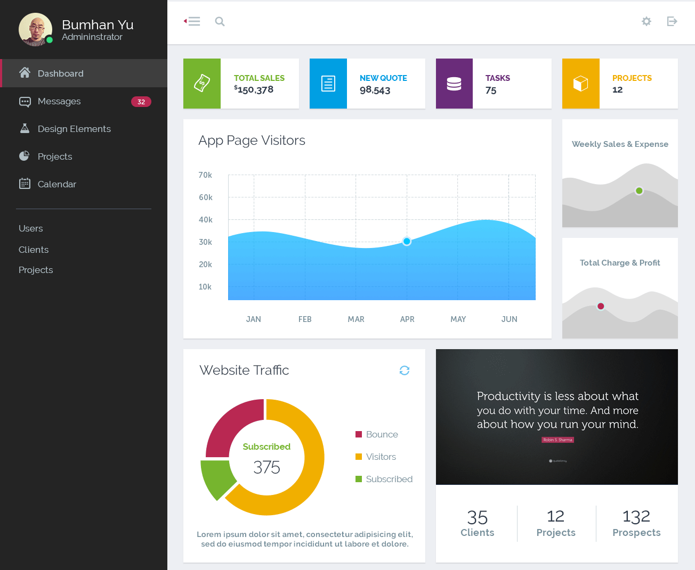
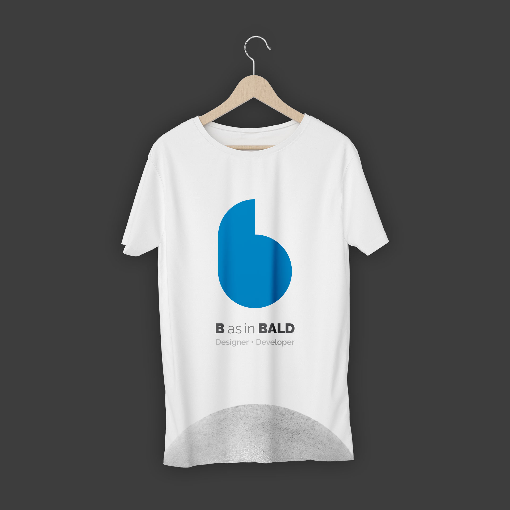
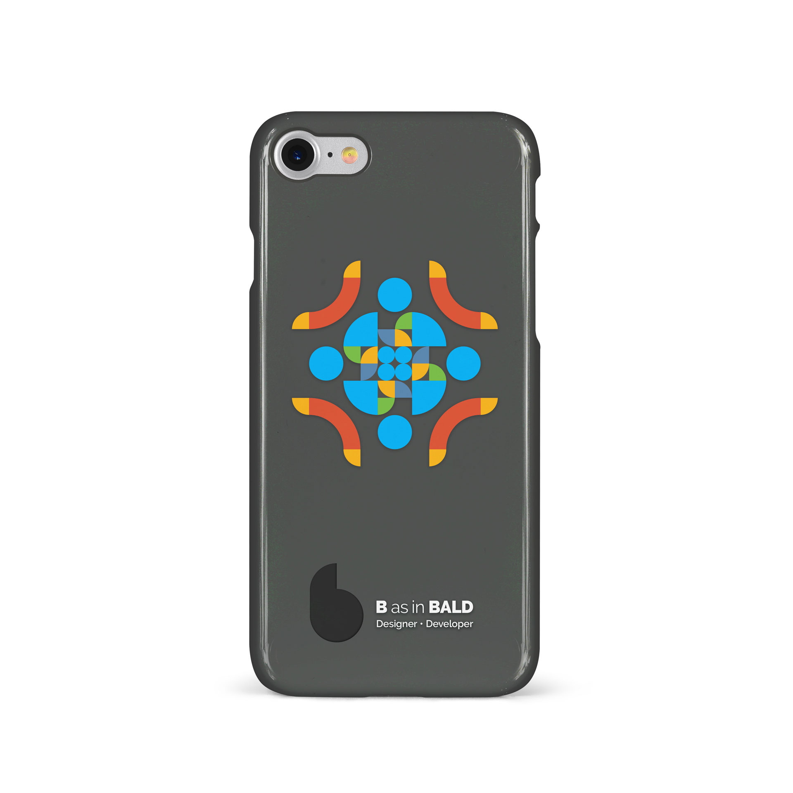
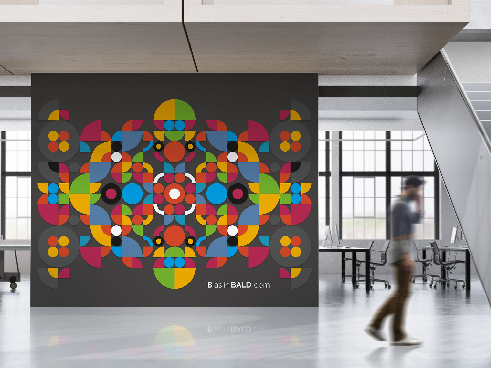
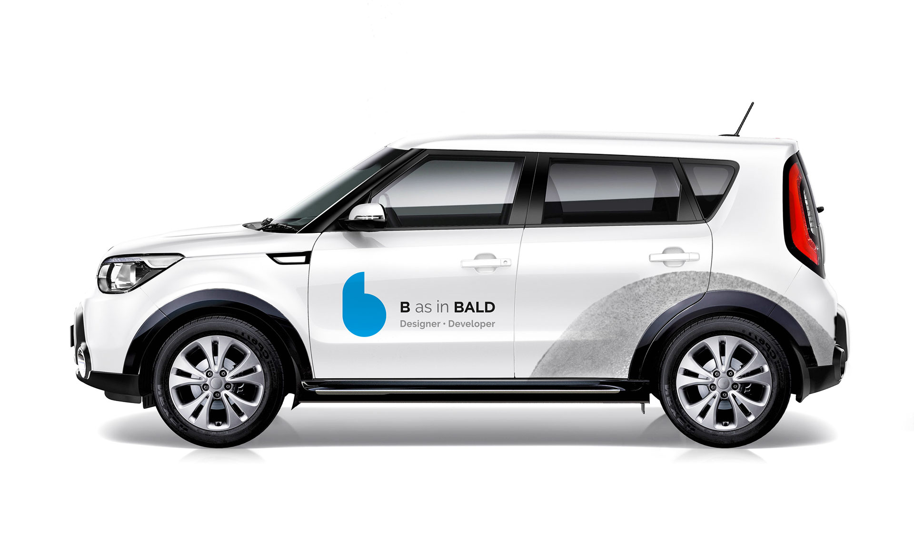
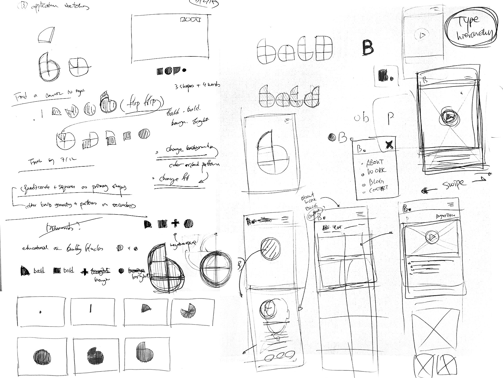
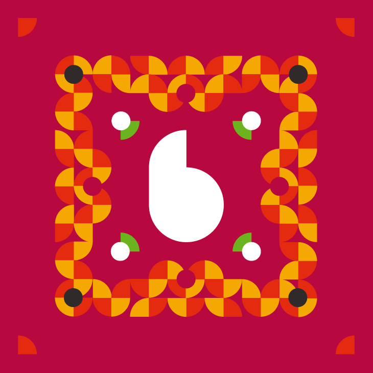

import { SimpleButton, ButtonContainer } from '../../components/SimpleButton';
import EmbedVideo from '../../components/EmbedVideo';

# Total visual communication system for creative consultation: identity system, responsive web hub, and blog

<section class="portfolioDetail">

### duties

concept development, design, develop

</section>

<section class="portfolioDetail">

### Dev Tools

`Gatsby/React`, `CSS-in-JS`, `MDX`

</section>

<section class="portfolioDetail">

### Challenge

Some call it <em>shoemaker's shoes problem</em>: I've been busy making visual solutions for clients yet never fully developed my own communication system. Upon starting my own independent consultancy after years of full-time career in the agency world, I had to be equipped with a clear platform for operation. Ultimately, I needed to convey that I'm not just another web designer who codes or another front-end developer who is good at <small>Photoshop</small>, and that I am a conceptual thinker, problem-solver, and builder who can perform fluently across media&mdash;upon atoms or bits.

</section>

<section class="portfolioDetail">

### Solution

The immediate goal was two-fold: 1) to create a visual identity system with cross-platform versatility, and 2) to develop an online platform as a professional hub. As for point #1, I conceptualized around minimal geometry that can construct from simplest shapes to the most complicated fractal structures, which connotes my professional versatility. Once I designed a logotype out of basic geometry, a vibrant color palette and motion elements were applied. To translate the motion and flexibility to print, I created a series of abstract patterns using the same geometric element and printed on the back of business cards.

</section>

<section class="portfolioDetail">

### Dev notes

Website is handcrafted from scratch in <small>HTML/(S)CSS/JS</small> with mobile-first approach, and finalized with <small>Jekyll</small>. All content sections are available in both English and Korean, each properly tagged with language meta data for proper <small>SEO</small>. `<head>` section was carefully crafted with practical meta data, including Open Graph tags. Everything was built with the modularity and flexibility in mind&mdash;from graphics to interactive components&mdash;and as an extended goal, each element will expand in scale and in content over time.

</section>

<ButtonContainer>
  <SimpleButton cta="GitHub Profile" link="https://github.com/baadaa/" color="var(--yellow)" />
  <SimpleButton cta="GitHub Repo of this site" link="https://github.com/baadaa/b-as-in-bald/" color="var(--green)" />
</ButtonContainer>

---

<EmbedVideo videoChannel='vimeo' aspectRatioPadding='56.34%' videoId="234397284" />

*Business card series: modular graphics based on the same geometry as the logo*

*Operations manager dashboard concept*

*Personal-branded shirt concept*

*Personal-branded phone case concept*

*Indoor oversize graphic concept*

*Vehicle wrap*

*Some of initial notes and sketches*

*Pattern graphics*
