# Flexible identity system based on modularity for an experimental museum in Korea&mdash;[Space of Design and Architecture](http://museumsoda.org/)&mdash;with versatility for motion, physicality, and interactivity.

<section class="portfolioDetail">

### duties

visual identity design, communication consultation

</section>

<section class="portfolioDetail">

### Challenge

The clients took over an abandoned construction project&mdash;_originally intended as a large public bath facility_&mdash;with the ambition to redevelop it as _an experimental museum_: the very first museum of its kind in Korea that provides _spatial experience_ as part of offering with clear focus on design and architecture. With less than six months until the launch date, however, they did not yet have visual identity system yet in place. While architectural development and exhibition planning were well on their way, they urgently needed to start promoting the project launch and designing collateral materials&mdash;and an overall communication design was largely absent.

</section>

<section class="portfolioDetail">

### Solution

The core philosophy of the project was to _rediscover, reinterpret, and redesign_ elements&mdash;often overlooked&mdash;in life in order to create unforeseen values. I thought that no monolithic mark could convey such openness and malleability, and wanted to develop _not only a logomark but a design system_. After a few rounds of pencil sketches, it became very clear we would resort to basic geometry of square and circle. By disassembly and reassembly, just as _SoDA_'s foundational concept, limitless combinations can take place to generate any shape and form. Once the design package was delivered, including a few iterations in motion graphics as a starter, the client took over and started to manage the brand communications themselves.

</section>

---

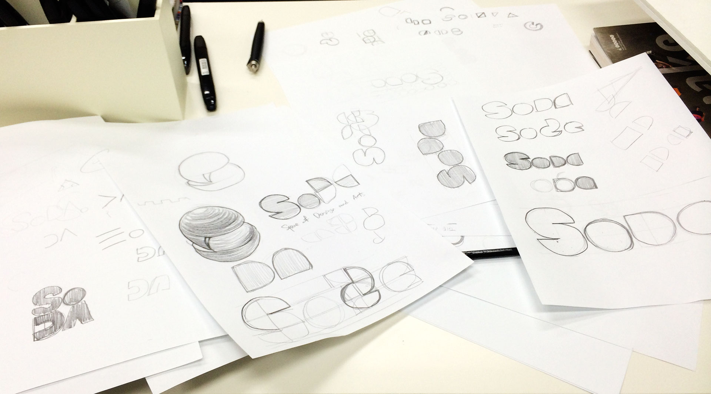
*Initial concept sketches at the first*

*Looping motion of the mark*

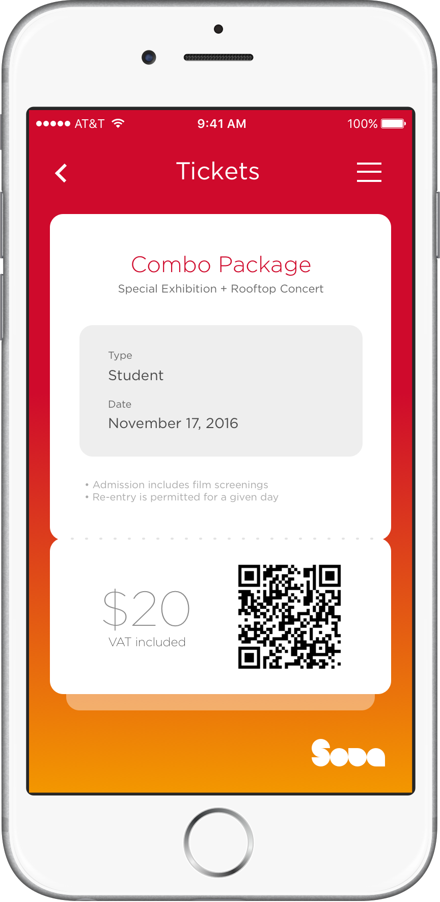
*Mobile/digital ticket concept*

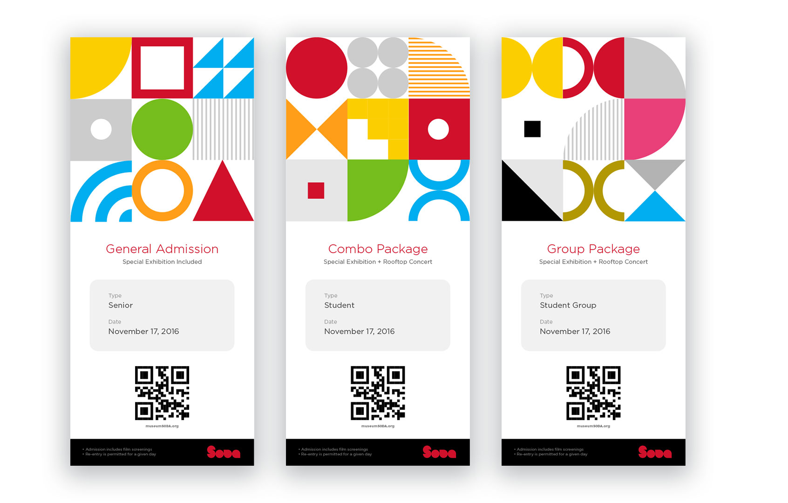
*Printed ticket concept*

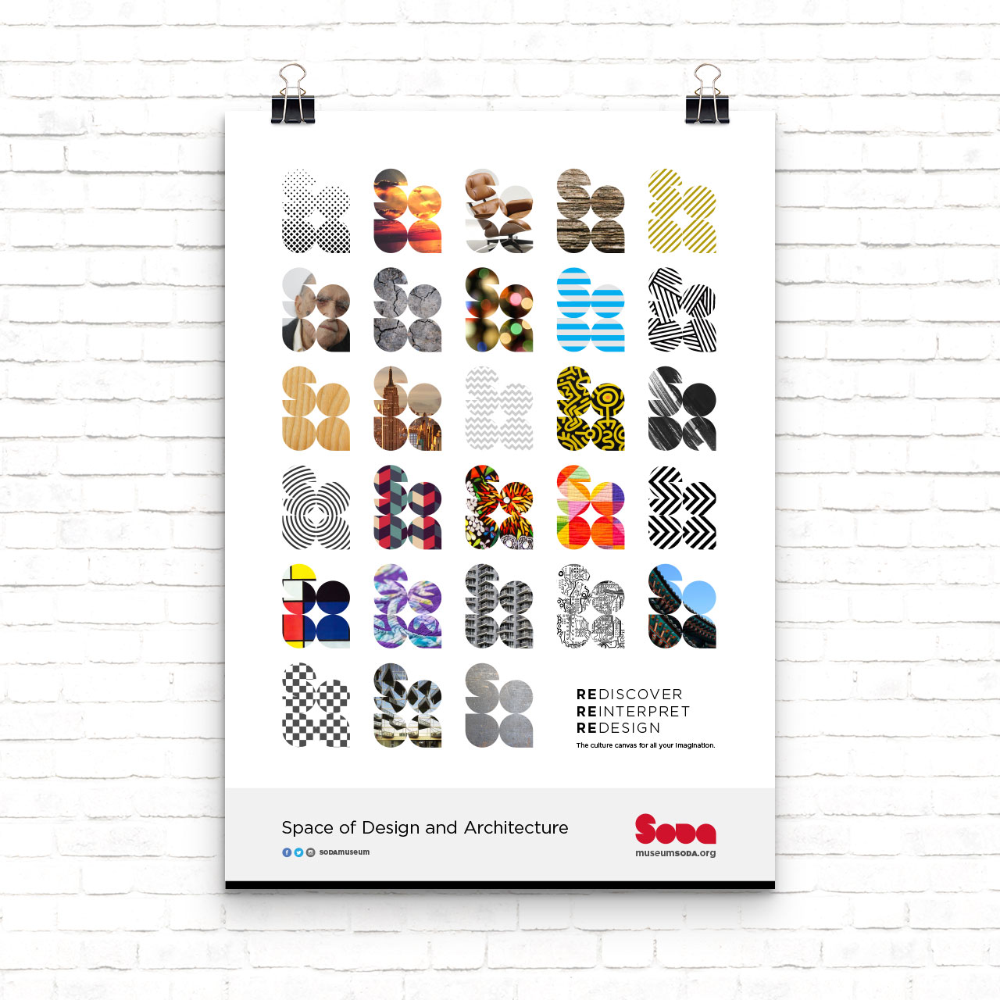
*Design poster concept*

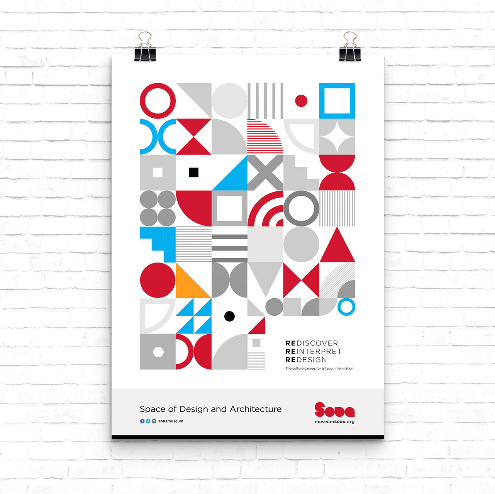
*Design poster concept*

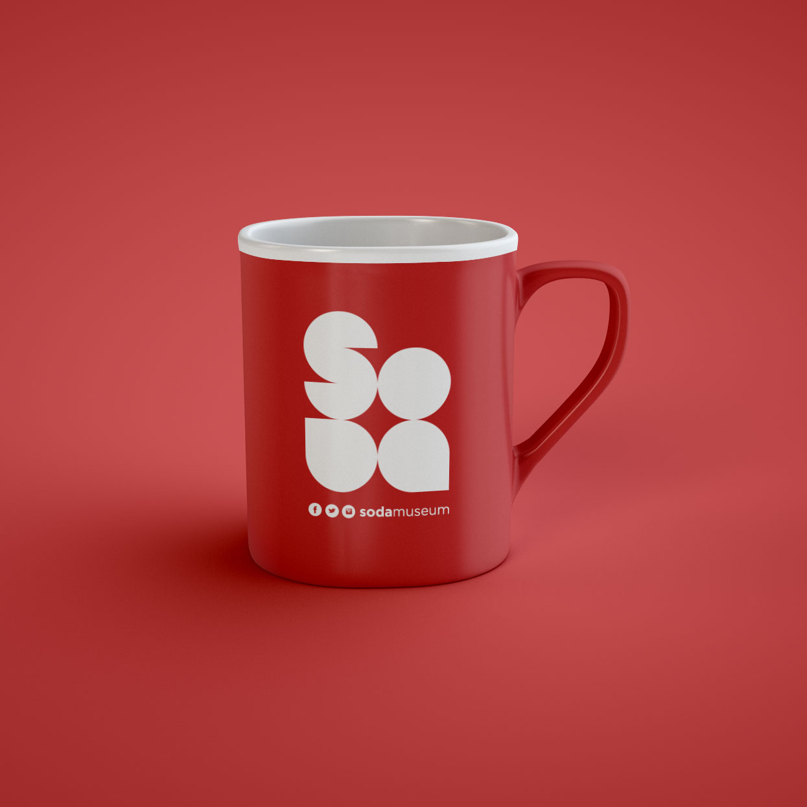
*Design mug concept*

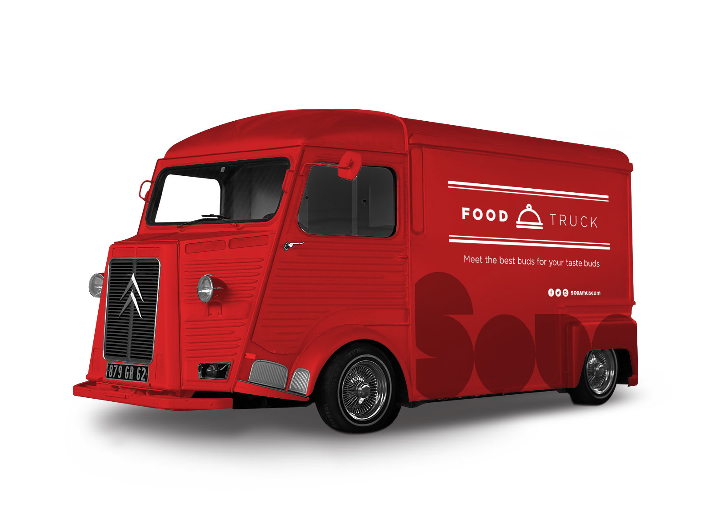
*Food truck concept*

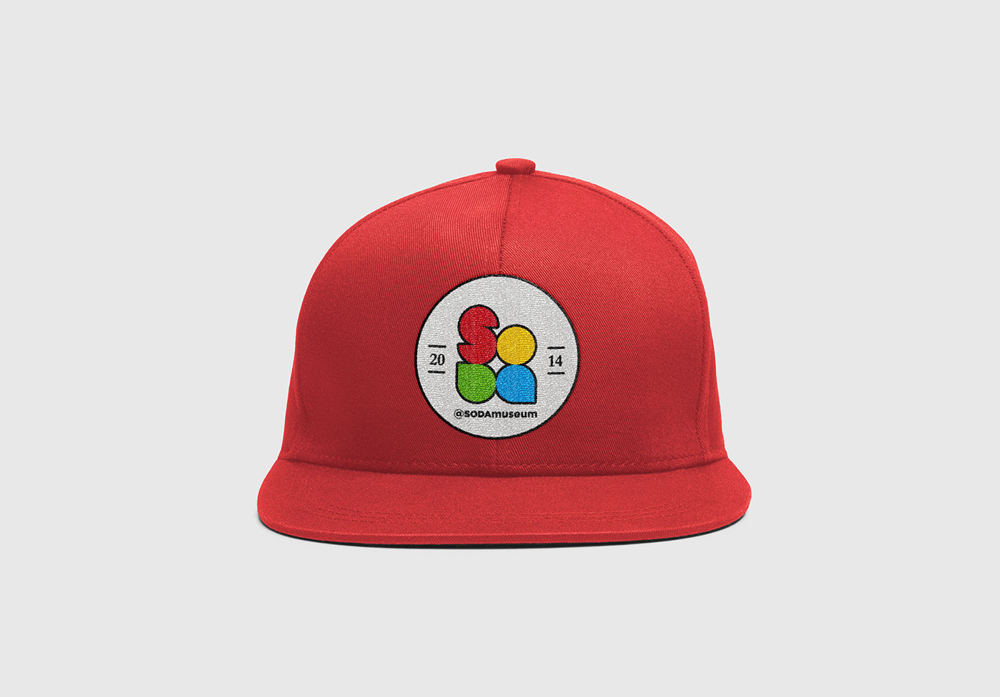
*Design cap concept*

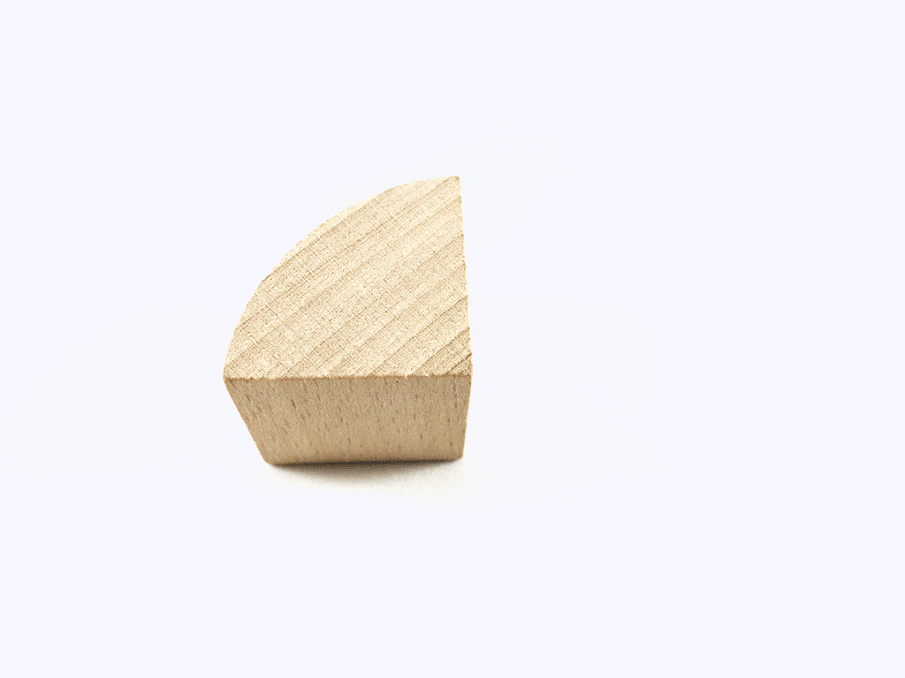
*Geometry wooden blocks concept*

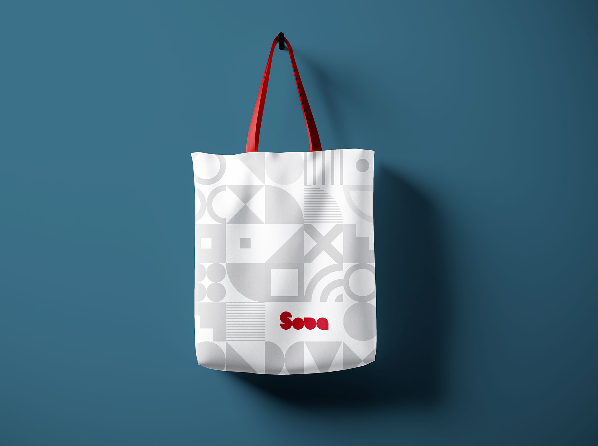
*Design tote bag concept*

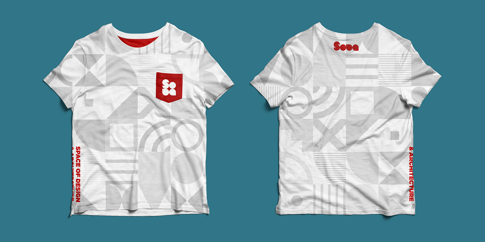
*Design T-shirt concept*
